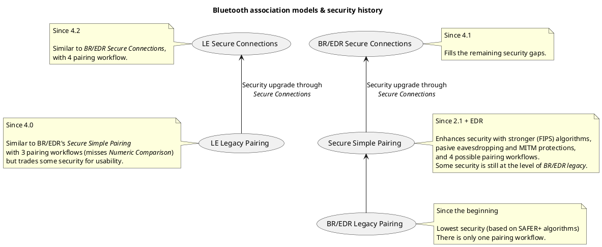

In this two-part article I describe the steps I had to take to make a *Raspberry Pi 4* play music as a Bluetooh AD2P receiver without a GUI (it's a headless RPi with only SSH access).

More precisely, the goal is to allow user friendly pairing for anyone in the room with a Bluetooth smartphone, while making sure the neighbors won't be able to connect without approval.

---

*This is a two-part article :*
1. *How Bluetooth pairing works (this part)*
2. *[Raspberry Pi as a Bluetooth A2DP receiver](Make-RPi-bluetooth-receiver-part-2) (part 2)*

---

## How Bluetooth pairing works

Bluetooth is quite a complex thing. Really. I didn't thought it would be that complicated when I started this mini project. Beside the original goal to be a wireless cable protocol, Bluetooth actually includes a myriad of features.
In order to understand how we should connect to our RPi, let's focus on some aspects of Bluetooth.

### Bluetooth security models

Being tightly coupled with hardware, Bluetooth has evolved a lot since its beginnings, following technical enhancements over the years.
This is why it has so many *security models* ; let's try to understand how they compare.

 the tradeof between usability and security in Bluetooth leans towards usability...

TODO define *BR/EDR* :

Basic Rate
Enhanced Data Rate (since 2.0 + EDR)

TODO define *Bluetooth Low Energy (Blueooth LE)*

From a protocol point of view, it's either BR or LE, BR can have EDR. However a Bluetooth controller may implement both, or a device may have several controllers each implementing BR or LE (or even AMP, in a secondary controller, in order to achieve Wi-Fi class transfer rates).

LE was introduced in Bluetooth 4.0.

Which one to chose ?

The Bluetooth Core Specification v5.2 makes it clear that :

> Secure Connections Only Mode is sometimes called a "FIPS Mode".
> This mode should be used when it is more important for a device to have high security than it is for it to maintain backwards compatibility with devices that do not support Secure Connections.

From what I've read (and understood) of the security implementation in Bluetooth, it was not made with security in mind from the beginning. There are so many tradeofs towards usability that *Secure Connections*, whether for BR/EDR or LE, looks mandatory to me.
*BR/EDR Legacy Pairing*'s security for instance *strongly depends* on the length of the PIN (which is often a 4-digit number, or even a fixed value) and provide little-to-none protection against eavesdropping and man-in-the-middle (MITM) attacks.
*Secure Simple Pairing* on its side only *"protects the user from MITM attacks with a goal of offering a 1 in 1,000,000 chance that a MITM could mount a successful attack"*. It leverages on failure alerts end users would receive to mitigate the risk, but this is anyway a *far lower level of security* than I would expect as of today.
Not going deeper, I just don't want my neighbors to accidentally connect to my RPi or any passing-by hacker to gather any personal informations about me.

Also, LE is the new BR/EDR. Most efforts seem to be put on Bluetooth LE and Bluetooh BR/EDR suffers from not being up-to-date with today's requirements anymore. For instance : in BR/EDR, cryptographic key generation is being made in lower, often hardware, layers, making it difficult to upgrade the security algorithms.
This is probably the fate of a very pragmatic specification that didn't intend to foresee the future of technology. Unfortunately this leaves us with a plethora of unsecure devices in the wild.

In the previous diagram, this leaves us with "LE Secure Connections" mode.
If it happens that some smartphone don't implement BLE, I'll have to make sure my RPi also works with "BR/EDR Secure Connections". Finally, if I'm out of luck and some device doesn't even implement *Secure Connections* I'll have to fallback to less secure pairing wokflows.

But for now let's concentrate on my favorite choice : "LE Secure Connections".

### Bluetooth association models

Here are the pairing workflows (or *association models*) [for Bluetooth Low Energy](https://www.bluetooth.com/blog/bluetooth-pairing-part-2-key-generation-methods/) we've talked about before :

- Legacy pairing
- Just Works
- Passkey entry
- Out-of-Band (OOB)
- Numeric Comparison

*Legacy pairing* was the only association model before Bluetooth 2.1 ; it requires the two devices to enter the same, 16-character, PIN code.
As stated before *Numeric comparison* for BLE exists only since Bluetooth 4.2 (as part of *Bluetooth LE Secure Connection* specification).
The 3 other ones are available for all devices implementing *Bluetooth LE Legacy Pairing* (Bluetooth 4.0).

Unfortunately, we cannot choose the association model ourselves : it is deduced from the devices' capabilities, called [**Input and Output capabilities for LE*](https://www.bluetooth.com/blog/bluetooth-pairing-part-1-pairing-feature-exchange/).

In order to make sure only workflows compatible with our headless use case are enabled, our RPi device must therefore advertise only the matching capabilites.

With *legacy pairing*, both devices have no other choice than coping with a PIN code. So, depending on their physical capabilities, they may allow a user to enter a fully UTF-8 text, only a numeric code or just use a fixed (usually hard-coded) PIN.

With other pairing workflows, there are full-blown tables describing the available IO capabilities and the mapping to the matching association models [Bluetooth Core specification (Vol 3, Part C, §5.2.2.4 "IO capabilities")].

Input capabilites :
- **No input** : Device does not have the ability to indicate 'yes' or 'no'
- **Yes / No** : Device provides the user a way to indicate either 'yes' or 'no'
- **Keyboard** : Device allows the user to input numbers to indicate 'yes' or 'no'

Output capabilities :
- **No output** : Device does not have the ability to display or communicate a
6 digit decimal number
- **Numeric output** : Device has the ability to display or communicate a 6 digit decimal number

And here's the mapping to get the matching association models :

<table>
    <caption>IO capability mapping to authentication stage 1</caption>
    <colgroup>
        <col class="col-header" />
        <col class="col-header" />
    </colgroup>
    <tr>
        <td colspan="2" class="empty"/>
        <th colspan="4">Device A (Initiator)</th>
    </tr>
    <tr>
        <td colspan="2" class="empty"/>
        <th>Display Only</th>
        <th>DisplayYesNo</th>
        <th>KeyboardOnly</th>
        <th>NoInputNoOutput</th>
    </tr>
    <tr>
        <th class="vertical" rowspan="4">Device B (Responder)</th>
        <th class="vertical">DisplayOnly</th>
        <td>Numeric Comparison with automatic confirmation on both devices.  Unauthenticated</td>
        <td>Numeric Comparison with automatic confirmation on device B only.  Unauthenticated</td>
        <td>Passkey Entry: Responder Display, Initiator Input.  Authenticated</td>
        <td>Numeric Comparison with automatic confirmation on both devices.  Unauthenticated</td>
    </tr>
    <tr>
        <th class="vertical">DisplayYesNo</th>
        <td>Numeric Comparison with automatic confirmation on device A only.  Unauthenticated</td>
        <td>Numeric
Comparison: Both Display, Both Confirm.  Authenticated</td>
        <td>Passkey Entry: Responder Display, Initiator Input.  Authenticated</td>
        <td>Numeric Comparison with automatic confirmation on device A only and Yes/No confirmation whether to pair on device B. Device B does not show the confirmation value.  Unauthenticated</td>
    </tr>
    <tr>
        <th class="vertical">KeyboardOnly</th>
        <td>Passkey Entry: Initiator Display, Responder Input.  Authenticated</td>
        <td>Passkey Entry: Initiator Display, Responder Input.  Authenticated</td>
        <td>Passkey Entry: Initiator and Responder Input.  Authenticated</td>
        <td>Numeric Comparison with automatic confirmation on both devices.  Unauthenticated</td>
    </tr>
    <tr>
        <th class="vertical">NoInputNoOutput</th>
        <td>Numeric Comparison with automatic confirmation on both devices.  Unauthenticated</td>
        <td>Numeric Comparison with automatic confirmation on device B only and Yes/No confirmation on whether to pair on device A. Device A does not show the confirmation value.  Unauthenticated</td>
        <td>Numeric Comparison with automatic confirmation on both devices.  Unauthenticated</td>
        <td>Numeric Comparison with automatic confirmation on both devices.  Unauthenticated</td>
    </tr>
</table>

### Putting it altogether with BlueZ

Finally, Linux systems have a complex Bluetooth stack, from which we will focus on the following components :

- a system daemon (from BlueZ implementation) handling the core Bluetooth stack
- modules to connect with specialized services (we will use ALSA/PulseAudio in order to receive sound from paired devices)
- registration agents, handling devices pairing in *our* headless-way

The Bluez daemon and the audio modules will only need to be configured correctly (which is already not trivial).
However I could not find a bluetooth agent matching my use case : the default agent has been deprecated ; the `bluetoothctl` command is not scriptable ; the `simple-agent` sample script does not implement the right capabilities. Some agent implementations I found around seemed to do the job but their code was not clear enough so while I introspected them to understand what they were doing and why, I ended up writing a new one, matching my use case.

Now let's identify which association model(s) fits our use case.

### Association models

#### Just works

This association mode has been thought when at least one device in the pair has no human interface.
Therefore, it does not enforce any confirmation whatsoever.

The Bluetooth Core Specification has a very neat way to describe it :
> The Just Works association model uses the Numeric Comparison protocol but
the user is never shown a number and the application may simply ask the user
to accept the connection (exact implementation is up to the end product
manufacturer).

If a *Just Works* model is triggered, the bluetooth agent may automatically pair with devices without a confirmation, or it may ask by some "headless" way a confirmation.
In the first case, although data exchange can be strongly secured, it cannot prevent an unknown device to pair.
In the latter case, it may require a fair amount of work to build such a confirmation mechanism.

Depending on the capabilities the *agent* declared, it may never be called in this association model.

#### Conclusion

The Bluetooth specifications don't provide a secure way use a fixed PIN code for headless devices.
A headless device may then adopt one of the following options :

- simply allow any device to connect ; data exchanges can still be secured, but will not protect against a MITM attack
- use a program (a *bot* actually) to simulate a user input, making sure no random number would need to be input
- develop advanced headless inputs (like audio speak / voice recognition)
- leverage on Out-of-Band protocol ?

---

**Part 1 is over, let's continue to [part 2 : "Raspberry Pi as a Bluetooth A2DP receiver"](Make-RPi-bluetooth-receiver-part-2)**

## References

- [Bluetooth Pairing Part 1 – Pairing Feature Exchange](https://www.bluetooth.com/blog/bluetooth-pairing-part-1-pairing-feature-exchange/)
- [Bluetooth Pairing Part 2 Key Generation Methods](https://www.bluetooth.com/blog/bluetooth-pairing-part-2-key-generation-methods/)
- [Bluetooth Pairing Part 3 – Low Energy Legacy Pairing Passkey Entry](https://www.bluetooth.com/blog/bluetooth-pairing-passkey-entry/?utm_campaign=developer&utm_source=internal&utm_medium=blog&utm_content=bluetooth-pairing-part-4-LE-secure-connections-numeric-comparison)
- [Bluetooth Pairing Part 4: Bluetooth Low Energy Secure Connections – Numeric Comparison](https://www.bluetooth.com/blog/bluetooth-pairing-part-4/?utm_campaign=developer&utm_source=internal&utm_medium=blog&utm_content=bluetooth-pairing-part-3-low-energy-legacy-pairing-passkey-entry)
- [Bluetooth Core Specification v5.2](https://www.bluetooth.com/specifications/bluetooth-core-specification/)
- [en.wikipedia.org/wiki/Bluetooth](https://en.wikipedia.org/wiki/Bluetooth#Pairing_and_bonding), 2020-04-10
